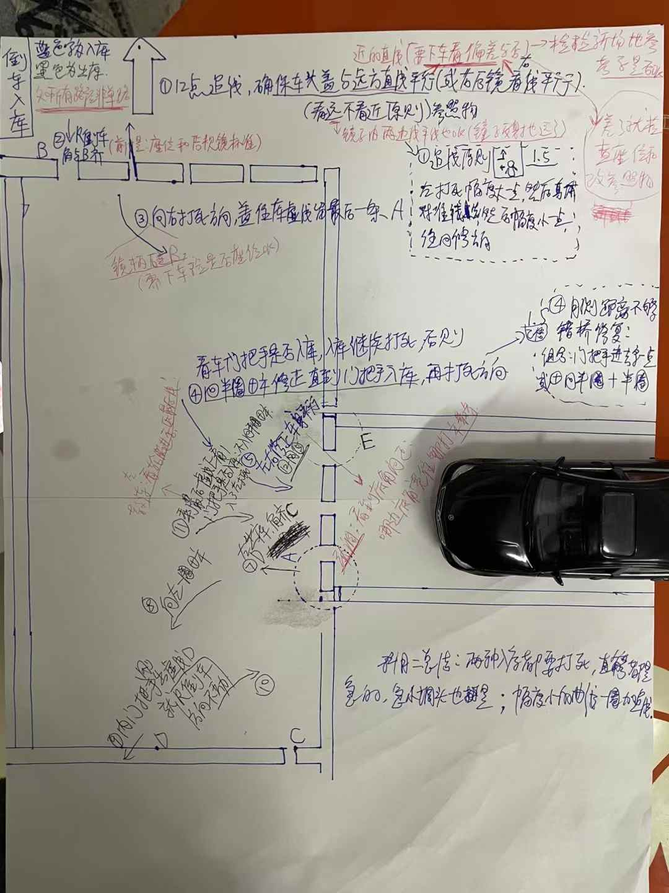
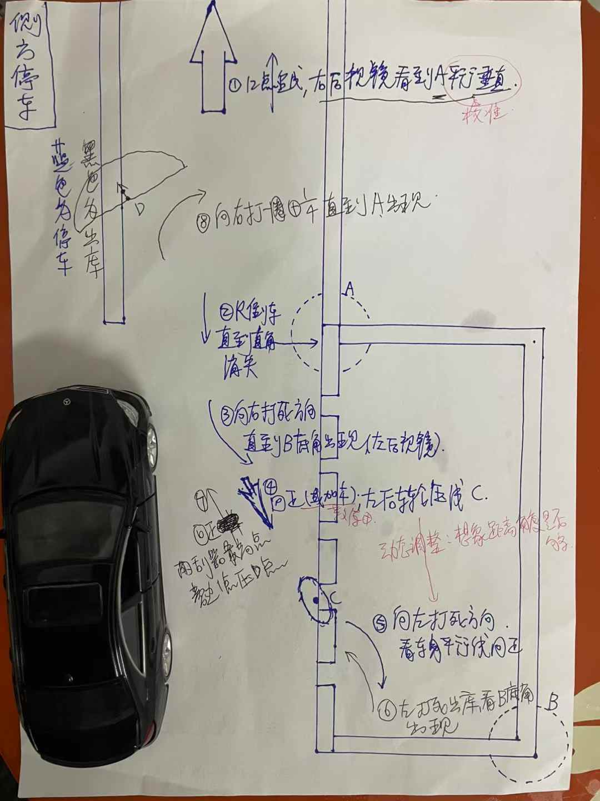
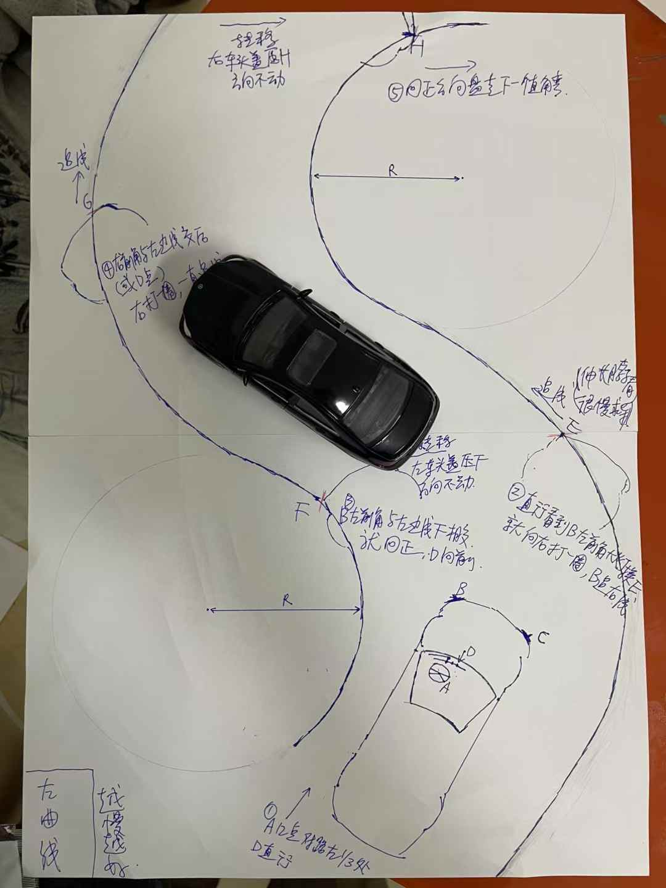
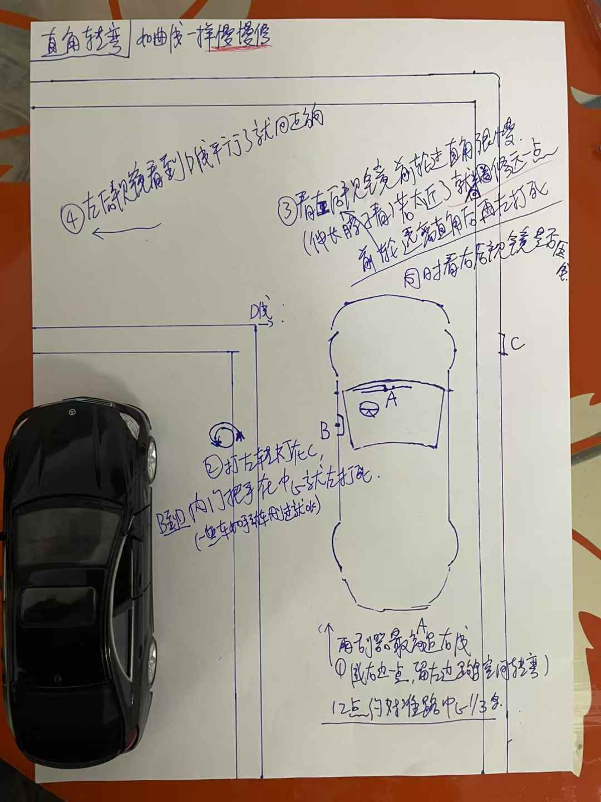
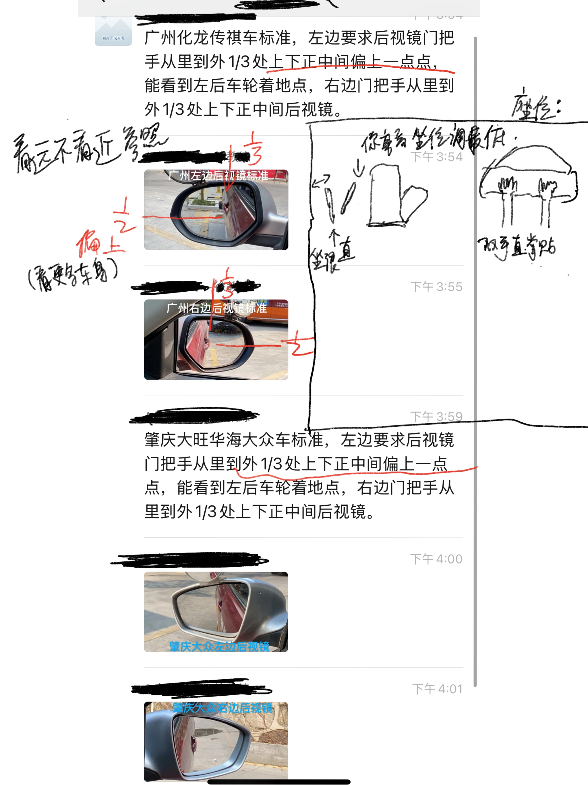

# 科目2

* 用AI生成图来辅助画画：画科目二等示意图
* AI生成C++ 3D游戏来模拟辅助画画
* ⭐️ 计算车身扫过的面积 & 行走的路径积分

## 真实当中的侧方停车，倒车入库，曲线行驶

* 对于不同的车看的点位也不同：SUV越野车视野更高，看车头盖跟到前面车尾巴是安全的距离
* 真实中的曲线行驶：对于很小的单个车宽度的山路，方向盘能过就车能过，走了乡下的几次路已经熟悉了
* 真实当中侧方停车，马路边上很多车位，以及需要判断车位是否能停车(比如路口无法停车，堵住别人出来不能停车)。路口停车需要忍住后面的喇叭一直哔你，多次修正停进去, 向右打死，然后回正R车身甩进去，后左打死。

---

## 倒车入库

## 侧方停车

## 曲线行驶

## 直角弯

---

## 座位和后视镜

