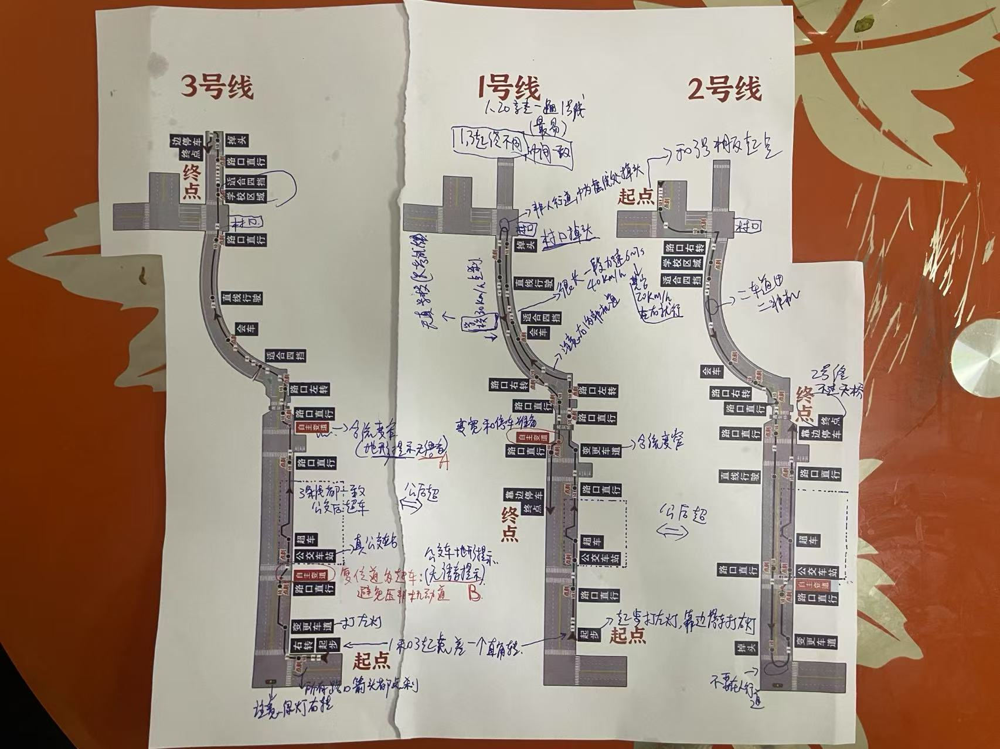

# 科目2

* 用AI生成图来辅助画画：画科目二等示意图
* AI生成C++ 3D游戏来模拟辅助画画
* ⭐️ 计算车身扫过的面积 & 行走的路径积分

## 真实当中的科目二：侧方停车，倒车入库，曲线行驶

* 对于不同的车看的点位也不同, 需要重新校准参考系适应车：SUV越野车视野更高，看车头盖跟到前面车尾巴是安全的距离. 比如看车身和右侧线(有些路没有此线)平行的距离位置，看后视镜平行什么参考线距离多远，然后车头盖压到前面车多少才OK最小安全距离
* 真实中的曲线行驶：对于很小的单个车宽度的山路，方向盘能过就车能过，走了乡下的几次路已经熟悉了
* 真实当中侧方停车，马路边上很多车位，以及需要判断车位是否能停车(比如路口无法停车，堵住别人出来不能停车)。新手路口停车需要忍住后面的喇叭一直哔你，多次修正停进去, 向右打死，然后回正R车身甩进去，后左打死。
* 倒车入库: 地下车库比较多，通常侧方停车使用率更高很多。TODO ...

## 真实当中的科目三：普通公路，高速公路

* 养成习惯看地图经过什么路口路况, 提前看高德地图导航头部显示路口距离信息，提前变道到左车道还是右车道，不然实线无法变道
* 路面行驶：**看远不看近原则**，能看多远看多远，看得越远越是能人车合一，有情况能最快做出应变
* 堵车变道时需要一点点车身甩进去，否则很难变道过去
* 路口都要减速查看路况，避免红灯忘了，或者是行人等
* 开车，变道要像做贼一样，眼观六路耳听八方，避免其他车同时变道到和自己同一个车道
* 高速公路保持一百米车距在快速行驶时，前面红灯点刹就要相应松油门点刹
* 高速公路前车速度一致，**相对静止跟车原则**：尽量去车更少的车道，跟住前方的车, 保持一致的开车速度
* 高速公路遇到大货车要确认安全之后，比对方更快速度，超过大货车，不要跟大货车和大货车并行行驶
* 高速公路超车不要变慢否则可能会追尾，最小极限距离是后视镜看到后车车头盖
* 高速公路**变速不变道原则**：千万不能急刹车除了要碰撞了情况，提前点刹然后减速后再刹住. 突然变道很容易追尾
* 高速公路的方向盘要很小微微修改，就像科目三直线行驶一样，**速度越快方向盘变动要越小原则**: 感应轮胎和车本身惯性，顺势而为去用方向盘微微调整, 然后人虚视觉坐在马路本车道中间, 目视最远方

---

## 倒车入库

## 侧方停车

## 曲线行驶

## 直角弯

---

## 科目三路线对比和口诀：
* 广州江高路线记忆口诀： 1 山峰 2试管 3反S(蛇) 。1变为停，2变为超，3变为合超
* 灯光口诀，交替灯：弯坡拱没人超, 停车示宽，其他复位为近光
* 停车交替看右边后视镜，平行一手指距离就OK
* 直线行驶快速一点40码，快了就不会左右修，导致识别车辆不稳.
* 直线行驶缓冲慢开回想下一个项目坐什么操作：校后加，学后超
* 科目四为科三的文科，应急，特殊天气路况，救急处理等安全常识，怎么安全怎么选

---

## 座位和后视镜

